# YamashitaIriePractExtra2425

### **Estructura Inicial del Proyecto**
1. Crea la siguiente estructura de archivos y directorios:
```bash
git init .
```
   ```bash
   mkdir -p proyecto-patrones/{docs,scripts,images,temp}
   touch proyecto-patrones/{docs/{manual.txt,guia.md,readme.txt},scripts/{app.js,utils.py,config.js},images/{logo.png,icon.jpg,banner.gif},temp/{pruebas.log,debug.txt,draft.md}}
   ```

(captura a l'apartat 2)

2. Verifica que la estructura es la siguiente:
```bash
tree
```
   ```
   proyecto-patrones/
   ├── docs/
   │   ├── manual.txt
   │   ├── guia.md
   │   ├── readme.txt
   ├── scripts/
   │   ├── app.js
   │   ├── utils.py
   │   ├── config.js
   ├── images/
   │   ├── logo.png
   │   ├── icon.jpg
   │   ├── banner.gif
   ├── temp/
       ├── pruebas.log
       ├── debug.txt
       ├── draft.md
   ```

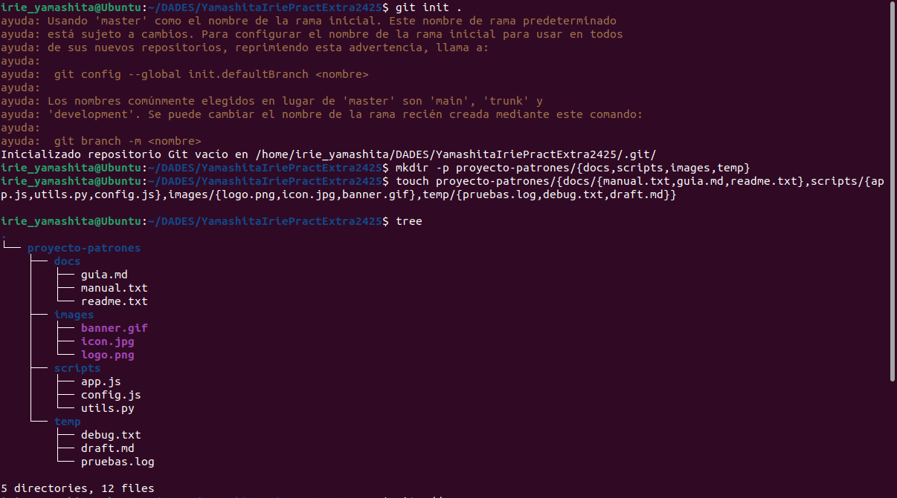

3. Inicializa el repositorio y haz un commit inicial.
```bash
git add .
git cm -m "primer commit"
git l
```
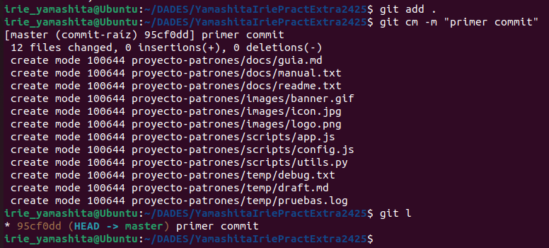
---

### **COMENZAMOS**

#### **1. Prepara archivos con patrones simples**

1. Añade  **solo** los archivos `.txt` que están en la carpeta `docs/` y muestra el estado.
>Modifico els documents  
```bash
cat > proyecto-patrones/docs/guia.md
cat > proyecto-patrones/docs/manual.txt
cat > proyecto-patrones/docs/readme.txt
```
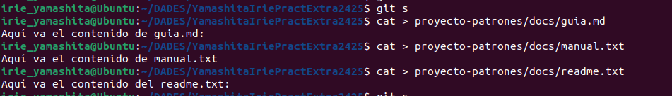

>Afegeixo només els arxius .txt  
```bash
git add proyecto-patrones/docs/*.txt
```

Abans i després:  


2. Haz un commit.
```bash
git cm -m "docs txt"
git l
```
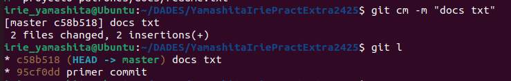
---

#### **2. Trabaja con subdirectorios y extensiones**

1. Añade **todos los archivos `.js`** del directorio `scripts/` pero **excluye `config.js`** y muestra el estado.
>Modifico els arxius
```bash
cat > proyecto-patrones/scripts/app.js
cat > proyecto-patrones/scripts/config.js
cat > proyecto-patrones/scripts/utils.py
```
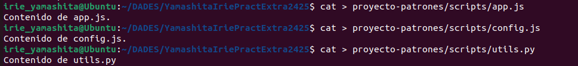

>Afegeixo tots els arxius menys config.js
```bash
cd proyecto-patrones/scripts
git ls-files *.js | grep -v 'config.js' | xargs git add
```
o també 

```bash
cd proyecto-patrones/scripts
git add *.js
git reset config.js
```

Abans i després:  
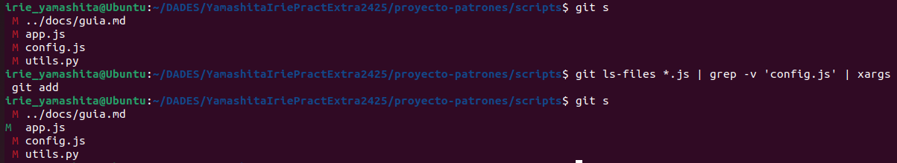

2. Haz un commit con los cambios.
```bash
git cm -m "scripts js"
git l
```
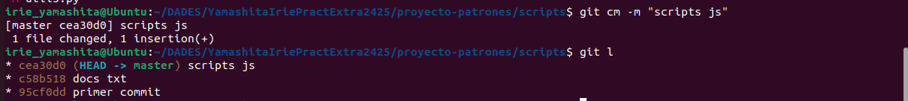
---

#### **3. Máscaras en niveles**

1. Añade **todas las imágenes excepto las que terminan en `.gif`**
>Modifico les imatges canviant el nom
```bash
mv banner.gif banner_mod.gif
...
```
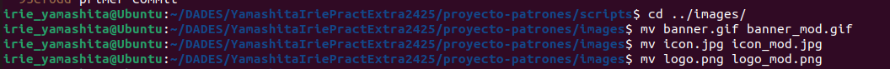


2. Confirma que los archivos `.png` y `.jpg` están en el área de preparación y muestra el estado.
```bash
git s
git add *.png
git add *.jpg
git s
```
Abans:  
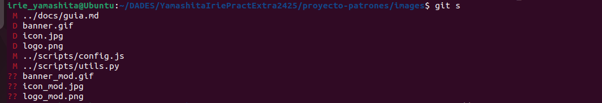  

Després:  
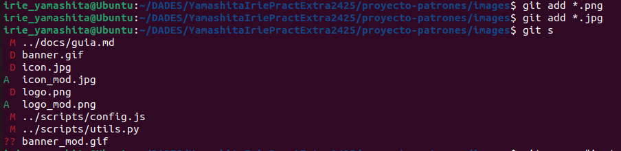

3. Haz un commit.
```bash
git cm -m "imatges no .gif"
```
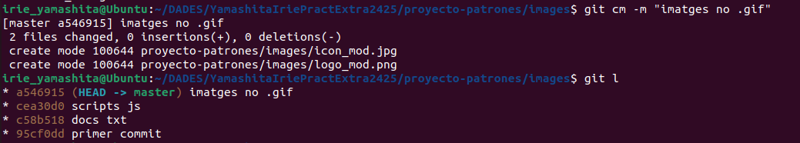
---

#### **4. Sube el repositorio Git Local al Remoto**

1. Ya sabes como hacerlo, si no te acuerdas tienes aquí la [guía de comandos](https://github.com/VelezBeatriz/ITB-M08-DAW1/blob/main/README.md)
```bash
git remote add YamashitaIriePractExtra2425 https://github.com/irie-yamashita/YamashitaIriePractExtra2425.git

git push  YamashitaIriePractExtra2425 master
```
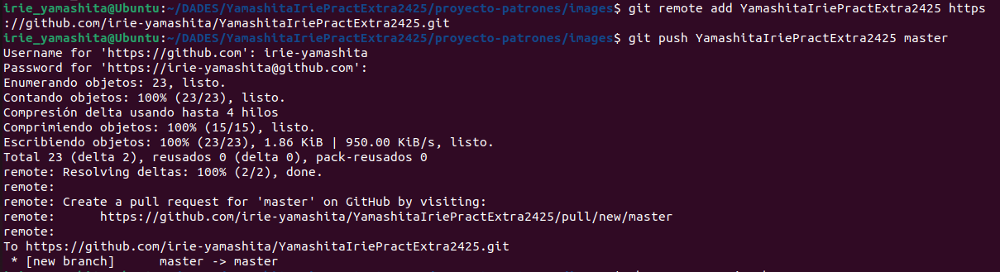